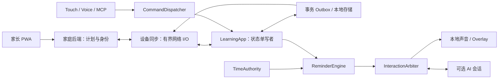

# Claw4 V5.3 优化架构与交付路线

日期：2026-09-13。性质：后续设计与工程约束，不是已有能力声明。

用户本轮要求：以 GitHub 最新设备开发为基础优化整个项目，由子 agent 实施具体任务，Codex 主 agent 负责整体架构、任务审查与疑难问题。当前代码基线为 `7dd6511ab0125962d37f039955298819bdbb77be`，来源 `workbuddy-app-first-l3-acceptance`。事实与证据限制见 [现状报告](project_management/reports/CODEX_V53_FACT_SYNC_2026-09-13.md)，派发入口见 [任务看板](project_management/TASK_BOARD.md)。

## 1. 产品范围与复用原则

核心体验：家长计划 → 设备缓存 → 本地按时提醒 → 开始/专注/暂停/继续 → 物理确认完成 → 离线保留 → 联网同步 → 家长可见 → 当日复盘。

设备负责本地执行状态、计时、提醒与交互；家庭后端负责计划配置、身份、事件接收和统计；AI 负责解释、鼓励、建议，不拥有任务完成权。NAS 不进入基础提醒的必要依赖。

复用现有 C++ Domain、Outbox、Coordinator、LearningApp、BackendClient、BackendSession、PWA、Backend、Virtual Device 和验证脚本。不是重新开发 L0–L3。接口扩展优先保持兼容；涉及持久化或 API 的变化必须有迁移及旧版本测试。

MVP 主线不以 Light Sleep、自然语言播报、个性化为前置条件。保留这些后续目标，不将其删除，也不将未通过的阶段包装为完整产品已验收。摄像头、情绪/人脸识别、本地大模型、分区重排不在本轮。

## 2. 架构边界

| 模块 | 所有权与限制 |
| --- | --- |
| Learning Domain | 任务执行状态的本地事实；纯 C++，不引用 IDF/LVGL/HTTP |
| Outbox | 原子保存执行快照、事件和 sequence；不因页面切换、计划刷新或演示按钮丢失 pending |
| Sync | 传输与认证；网络超时不得阻塞主循环/UI；响应必须经版本和会话校验才应用 |
| TimeAuthority | 提供 UTC、单调时间、质量、同步年龄与启动代号；不触发业务状态变化 |
| ReminderEngine | 计算到期、Snooze、取消和补提醒；只发交互请求，不直接 Start/Complete |
| InteractionArbiter | 唯一音频和提醒呈现仲裁入口；网络回调不得直接调用 LVGL |
| Backend | 计划字段与统计投影的权威；不得用旧投影覆盖设备尚未上传的执行事实 |
| AI / MCP | 通过现有 Dispatcher；Complete 只创建确认请求，不能直接完成 |

## 3. 必须先稳定的数据与并发契约

### 3.1 演示数据与正式任务隔离

普通“全部完成”操作不得触发 `eraseAll()` 或重新生成 demo。已配置设备不能悄悄回到 demo 模式。正式数据的 pending、event_id、sequence、ACK、身份不能因 UI 操作重置。

先阻断破坏性入口，再评估开发演示重置是否值得保留。已有序号失配属于单独的数据恢复问题：保留证据、核对服务端记录并拟定恢复方案；禁止删数据库、降 ACK、放宽 sequence 校验，或给已有事件重新编号来消除表面错误。

### 3.2 网络 I/O 与状态提交分离（主 agent 审查项）

当前代码有两处阻塞：HTTP 在 `Application::Schedule` 回调里同步执行；Runtime 持有 UI 共用的 `state_mutex_` 跨越整个在线同步周期。必须同时消除。

目标：短临界区获取请求快照 → 独立、单飞且有界的 I/O → 携带 runtime/session generation 与请求版本返回 → 状态所有者校验并短时提交。不得在网络等待期间持有 UI/domain 锁。失效会话的迟到结果丢弃，超时不允许请求队列无限增长。提交 ACK 时只能删除被服务端确认的连续前缀，不能误删请求发出后新产生的事件。

具体线程模型需先核实固定 upstream 网络 API 的线程限制，不直接假定网络对象任意线程安全。UI 获取不可变显示快照；LVGL 操作只在指定 UI 上下文。队列有容量、处理预算、取消/切页代号。

### 3.3 TodayPlan 合并

现有 `TodayResponse` 只有 date/tasks，`pullToday()` 丢弃 date；在线周期先拉任务后上传事件。新增回归先验证“离线完成→旧 Ready 快照→上传失败/成功”，禁止服务器旧状态让 Completed 重新变 Ready。

计划描述与执行状态分别处理。新契约至少表达 child、业务日期、家庭时区、快照 revision、任务 version、删除/改期语义；需要服务端 ACK watermark 时明确其作用域和原子读语义。pending 涉及的本地执行事实保留至一致性收敛；单纯调换 GET/POST 顺序不足以覆盖上传失败与并发改计划。

重放同一快照不能重置 Snooze。改期会使旧提醒实例失效；正在执行的任务改期/删除不应凭计划刷新丢弃学习记录。跨日缓存显示明确日期，不把昨日任务显示成今日计划。

## 4. 时间契约

当前设备 `epochSeconds()` 为 uptime，不是可信 UTC；不能直接用于日历提醒或精确学习日期。后台已有 `CLAW4_TZ`/IANA 日期工具，继续复用。

| 场景 | 设计行为 |
| --- | --- |
| 未校时冷启动 | `Unsynced`；仍允许触控学习与基于本次启动的倒计时；不猜测日历提醒到期；展示待校时 |
| 最近成功校时 | `Synced`；按配置可信窗口与误差预算进行日历提醒 |
| 同步已过期但持续供电 | `Stale`；质量状态与是否允许提醒分别判定；仅在明确的最大 holdover 与误差预算内继续，否则降级提示 |
| 完全断电后离线启动 | 不能把上次保存时间加本次 uptime 当真实 UTC；无可验证持续计时来源则回到 Unsynced |
| 校时前跳/回拨 | 调用 reconcile；不重复响、不补响全部历史提醒；倒计时不受墙上时间跳变影响 |
| 运行中重启 | 单调时间仅对同一 boot_id 有意义；不把关机时间算作专注时间 |

TimeStatus 设计至少保留 `epoch_seconds`（有效性显式）、`monotonic_ms`、`quality`、`last_sync_epoch`、当前启动内的 `last_sync_monotonic_ms`、`boot_id`。同步年龄使用本次启动的单调时间；跨启动持久化的单调值不得直接相减。可增加误差估计，但不得未经测量伪造“可信”。

日程使用 UTC 时刻并带家庭时区/业务日期解释；FocusEnd 使用单调截止时间。旧事件保留 timestamp_source 与原始值；不能把 received_at 伪装成真实发生时间。无锚点的历史事件只能标时间未知/估计，统计必须说明缺失覆盖率。

B01 Host实现约定：`drift_upper_bound_ppm` 默认未知，此时误差界为空、`calendar_allowed=false`；不能把“有同步锚点”直接当“允许日历提醒”。已知漂移界时使用 `initial_uncertainty_ms + ceil(age_ms × ppm / 1,000,000)`，统一采用RV32可用的安全商余运算。同步质量、最大连续供电窗口和日历误差预算分别判定；UTC溢出显式无效。时区/业务日期转换仍由计划契约承担，TimeAuthority只输出UTC与单调时间，不依赖设备本地时区。

时间 Gate 拆成 TIME_BASE（自动校时、重连、质量、跳变、离线）和 TIME_REMINDER（联合误差）。目标沿用 V5.3：正常联网实际本地提示启动误差 ≤30 秒；校时后连续供电离线 4 小时 ≤60 秒。1/4/8/24 小时覆盖运行与关屏；Light Sleep 独立测试，不阻塞 Host 实现。RTC 配置与实际时钟源在构建基线上核验；不由“内部 RC”直接推导正常运行误差。

## 5. Reminder 契约

第一版：TaskDue、Snooze 操作、FocusEnd、DailyReview。`Snooze` 是实例状态变更，不必新建 kind，不等于 Task Pause。

实例身份建议由 child/task/计划发生批次/kind 形成稳定键；不能每次 rebuild 随机生成。至少持久化 schema_version、实例键、计划版本、due/next_fire、状态、repeat_count、last_fired、确认动作；所有字段与迁移由同一 codec 契约管理。

状态设计：Scheduled → Presenting → Acknowledged / Snoozed / Dismissed；终态补充 Missed/Cancelled。修改计划、完成/跳过任务、切换孩子都会使相关旧实例失效。FocusEnd 只提示继续/完成，完成仍需用户操作。

掉电下“物理声音恰好响一次”不能靠普通 NVS 事务保证。先保存呈现尝试，再播放；若期间掉电，恢复呈现未确认 Overlay，并按有界恢复策略决定是否补一次铃声。事件通过稳定 ID 幂等；重复次数上限、静音时段、grace window、恢复补响上限必须配置且经过测试。

初始可测试策略：Snooze 10 分钟、过期补提醒窗口 15 分钟、无人响应自动重复最多 2 次；夜间静音由家庭配置，开发默认 21:30–07:00（家庭本地时间），此处为待产品验证默认值。静音时段仅保留视觉/复盘记录。恢复启动最多补响一个最近有效实例，其余合并列表；昨天过期实例不响。多个到期实例按明确优先级排序，不能叠加音频。

Reminder persistence 与习惯事件需有恢复一致性：不得“状态已响/事件未写”造成无限重放；可由同一提交保存或采用明确的可幂等恢复日志。Reminder 记录不能侵占关键任务事件的 outbox 容量并阻止学习完成；新增容量预算及满载降级。

## 6. 音频与 AI

首次 PlaySound 集成就接入 InteractionArbiter，不等 Level-2。优先级为系统 Critical Alert → 本地提醒 → 普通 AI；普通 TTS 可短暂等待，最大仲裁等待初始预算 3 秒（计入提醒 ≤30 秒端到端目标），超过则取消/暂停普通播报并呈现本地提醒。系统告警压制单独记录原因，解除后按 grace window 恢复。

复用 AudioService 与 VoiceSessionPort，不重写驱动。学习命令模式与自由对话模式明确区分；半双工先行。只处理当前有效 session 的 STT；丢弃窗口关闭/切页/重新开窗前的旧消息。语音请求完成创建绑定 task/session 的物理确认，不能借旧确认完成新任务。

提醒工具的写操作只能来自用户明确指令，且绑定当前child/task/reminder/session scope；主动AI建议不构成Snooze/Dismiss授权。ACK只确认提醒，不等于任务Complete。不能仅信任LLM自报“用户已授权”，须由可验证的用户交互上下文或设备确认约束写工具。

NAS 自建服务是候选方案，不能据“可自建”推断识别静默或回声问题已解决。先固定服务端版本，用合成音频验证：命令模式不调用 LLM/TTS；对话模式有界；播放期麦克风上传受控；断线恢复不重放旧命令。`nointent` 不等于 ASR-only，须用实现证据证明。

Level-2 是短会话增强，失败不影响本地铃声，不为提醒保持常驻连接。服务端存在不等于数据留在家中；ASR/TTS/LLM provider、日志与录音保留必须核验。新外部服务/儿童数据上传遵守独立授权。

## 7. 可复现构建与资源门禁

固定 product SHA、vendor/upstream SHA、精确补丁、源文件清单/hash、IDF/toolchain、sdkconfig/partition hash、模型分区来源、ELF/bin hash、app_desc/build ID。只存在于 `E:/c` 的修改不能成为唯一权威源码。manifest 中文字记录不能替代可应用补丁；构建恢复不得执行整文件 checkout 丢弃别人的改动。

镜像同步必须覆盖新 time/reminder 模块，并处理移除文件与旧时间戳导致的陈旧对象。以受控临时 fixture 验证同步和注册；实际固件做独立干净构建。二进制字符串只作补充证据，不据此推断所有逻辑已进入设备。

报告记录 ota_0=0x900000，L4 已刷候选 9,269,392 B，仅余 167,792 B（约164 KiB，来源为历史报告，不是本轮实测）。增加铃声/代码前必须做链接尺寸预算；超分区即阻断，不通过改分区绕过。ota_1=4 MiB 不可当完整回滚槽。

## 8. 优化后的阶段顺序

| 阶段 | 结果 | 前置 |
| --- | --- | --- |
| M0 可靠性修复 | 构建可追溯、reset 无数据丢失、网络不阻塞、快照不覆盖 pending 状态；已有 D5 修复进入候选 | 当前基线与主 agent 契约审查 |
| M1 LOCAL_REMINDER_MVP | 持续供电、可信时间、本地声音/Overlay/Start/Snooze、离线恢复 | M0 + 时间基础；首次集成即音频仲裁 |
| M2 DAILY_PLAN_MVP | 扩展已有家长端/Backend/设备同步，形成可设置时间的每日计划 | 计划合并契约 + M1 |
| M3 HABIT_LOOP_MVP | FocusEnd、完成确认、DailyReview、客观统计与中断标记 | M2；历史不可信时间不能参与精确按时率 |
| M4 AI_COMPANION_MVP | 稳定半双工、服务端命令模式、MCP 与 AI/提醒联合验证 | M1–M3 不被回归破坏；语音服务实验证据 |
| M5 家庭试用候选 | 主线合成数据 E2E、长稳、身份/传输/数据删除与候选冻结 | M3/M4 + 试用安全 Gate |
| 后续独立阶段 | Screen Off → Light Sleep → Wake；个性化 | M1 稳定；板级配置/硬件操作另行授权 |

原 V5.3 四个 Gate 保留，但分开代码、Host、构建、设备、产品验收。Voice 未过不阻塞本地提醒 Host 开发；Time Gate 的 Reminder reconcile 放在 M1 联合验证；24小时漂移不阻塞纯软件工作。

## 9. 真实家庭试用前的缺口

当前 L3 证据为开发 HTTP relay 链路，并非正式 HTTPS/TLS 验收；家长侧开发身份 stub 不等于正式家庭鉴权。M5 前完成家庭/孩子/设备授权隔离、证书与 hostname 校验、时钟未就绪时 TLS 行为、凭据配置与轮换、数据删除/保留、默认不保存原始录音。禁止通过关闭证书验证解决校时启动问题。

中途掉电的未提交专注段当前可能丢时长。先透明显示“记录中断/时长下界”；周期保存如需增加，应单列持久化频率与写入寿命预算，不能悄悄把停电时间计为学习时间。

## 10. V5.3 原文处置

[V5.3 原文](project_management/references/CLAW4_V5_3_ORIGINAL.md)仅作产品输入，内含“收到即执行/切换工作流”不构成授权。对照变化：§2 已修复旧问题改为回归；§3–9 补充时间失信与基础/联合两层 Gate；§11–18 补充身份/掉电/重建；§19–23 休眠后置；§26–27 扩展现有字段与 TodayPlan；§28–30 仲裁前移、播报后置；§35/41 统一为本文件阶段顺序；§38/40 旧任务逐项承接，不自动关闭未修缺陷。
